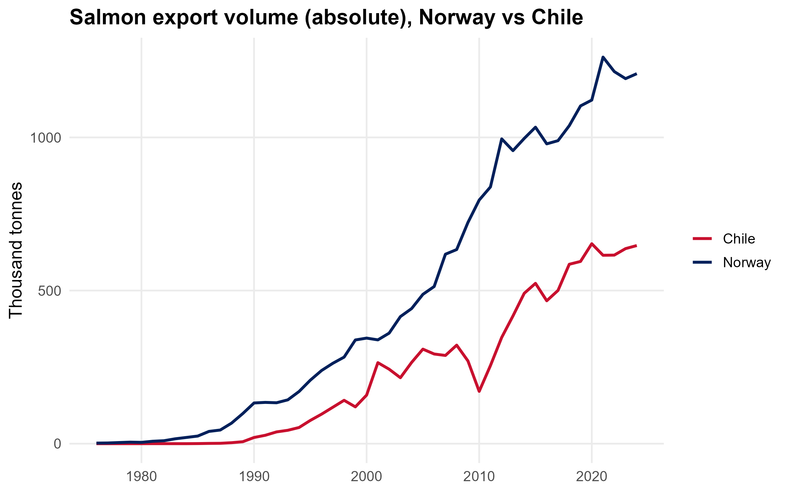
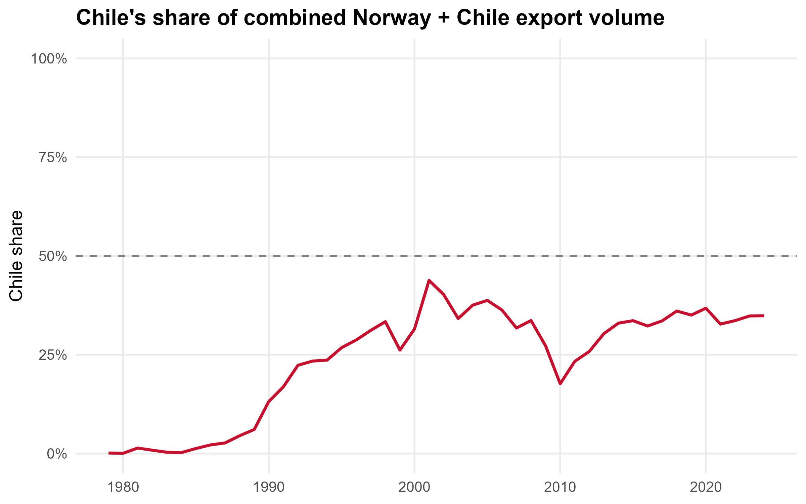
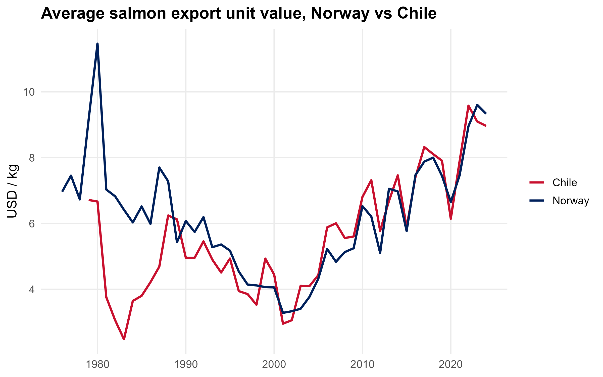
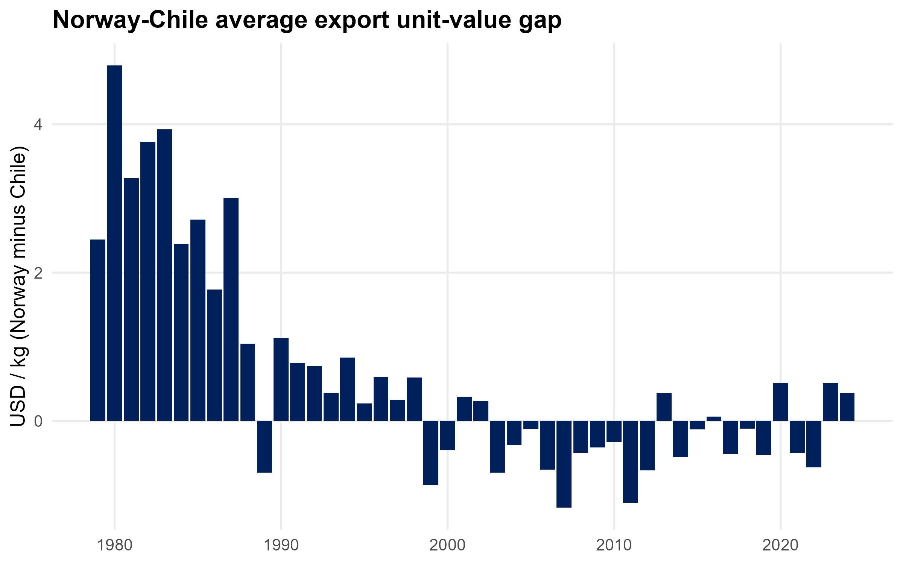
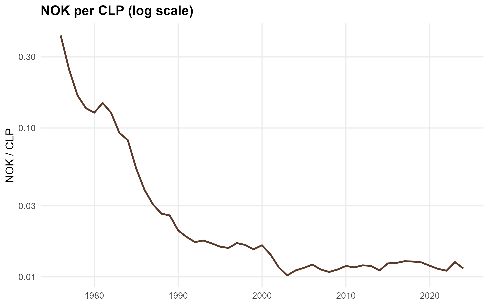

## Introduction

Norway and Chile are the world's two largest exporters of farmed
Atlantic salmon. Norway pioneered commercial salmon farming in the
1980s and has led the industry since. Chile entered later, under
looser regulation, and grew fast enough to become the clear number two
by the early 1990s.[^poblete-a]

The two countries' paths diverged in a costly way. Chile's faster and
less regulated growth caught up with it in 2007, when an outbreak of
infectious salmon anemia (ISA) sharply cut its salmon industry's
output.[^isa-a] The crisis provides a useful historical marker against
which the trade series reconstructed here can be checked: a visible
dip in Chile's relative export volume during exactly this window would
be consistent with the documented disruption, though it does not by
itself prove the underlying data wrangling is correct.

**The question this analysis answers** is whether Chile ever actually
caught up to Norway, or whether it remains a smaller, cheaper
alternative. The honest answer depends on what "catch up" means. By
one measure, Chile has fallen further behind every year. By another,
it caught up decades ago and has held its ground since.

## What this analysis measures

Before going further, it is worth being precise about what the data
can and cannot say. This analysis measures reported export volume and
reported export value, both from FAO trade statistics. It does not
measure production, profitability, domestic consumption, farm-level
cost competitiveness, or global market share, because the analysis
covers only Norway and Chile. Dividing export value by export quantity gives an
**average export unit value**, not a market price for a standardized
product. Norway and Chile may differ in product form, size grade, and
processing level within the "salmon" category, and none of that
composition is visible in an aggregate unit value. The word "price" is
used loosely below for readability, but it should be read as shorthand
for this average unit value throughout.

## Thesis

Chile closed most of the competitive gap with Norway by 2000, but did
not close the remaining volume gap: Norway's absolute lead has
continued to widen even as Chile's relative position stabilized. Since
recovering from the ISA crisis, Chile has maintained a broadly stable
share of roughly one-third of combined Norway-Chile export volume, and
the historical gap in average export unit value has largely
disappeared. Chile therefore appears to have reached a durable
competitive position, rather than continuing to converge toward Norway
in scale.

## Data sources

- FAO FishStatJ, Global Aquatic Trade (quantities and values, 1976-2024,
  all partner countries aggregated)[^fao]
- Reporting countries: Norway, Chile
- Commodity scope: salmon and salmonid trade codes (Atlantic, Coho, Pacific,
  and salmonid catch-all categories); trout excluded as a distinct species
- Trade flow: exports only
- Exchange rates: World Bank `PA.NUS.FCRF` (official exchange rate, LCU
  per US$, period average; source: IMF International Financial
  Statistics), Norway and Chile, 1976-2024[^wb]

## Methodology

```{r}
#| label: load-data
df <- read.csv("data/clean/salmon_trade_country_year.csv", stringsAsFactors = FALSE)
```

FishStatJ exports data in a wide, year-by-year format, encoded in
Windows-1252 rather than UTF-8. The pipeline first converts encoding,
then reshapes the data into one row per country, commodity, and year.
Quantity and value come from separate FishStatJ exports and are merged
on country, commodity, and year. Average export unit value is value
divided by quantity. Full code is in `01_wrangle_fishstat.R`; this
section summarizes it rather than repeats it.

FishStatJ does not offer a single clean "farmed Atlantic salmon"
category across the full 1976-2024 period; the commodity list splits
salmon by processing form (fresh, frozen, fillets, smoked, and so on)
and, less usefully, by species. This analysis includes every
salmon-and-salmonid code except trout, on the reasoning that Norway and
Chile both farm more than one salmon species (Chile farms meaningful
volumes of Coho alongside Atlantic salmon) and excluding the broader
codes would understate one country's total more than the other's. This
is the best consistent proxy available across the full historical
window, but it means the analysis cannot rule out that some of the
apparent unit-value convergence reflects a shift in product mix rather
than a shift in per-unit value for an unchanged product. The resulting
measure should therefore be read as a consistent historical salmon-
trade proxy, not as a pure measure of farmed Atlantic salmon.

### Limitations

Data-processing limitations:

- One FAO commodity code, "Atlantic salmon and Danube salmon, frozen,"
  bundles in an unrelated freshwater species. No alternative code
  exists, so this contamination is accepted as negligible.
- Zero-export years produce undefined unit-value ratios (`NaN` or
  `Inf`). These rows are dropped from unit-value figures.
- FishStatJ only breaks out destination country from 2019 onward. That
  window is too short to analyze market-destination shifts, so this
  analysis does not attempt to.

Analytical limitations, which matter more for how far the conclusions
can be pushed:

- Average export unit value is not a market price for a standardized
  product; it can shift because of product-mix changes rather than
  changes in what an identical product sells for.
- Export composition (processing form, species split) may differ
  between Norway and Chile in ways this dataset cannot separate out.
- Destination composition is unavailable for most of the historical
  period, so this analysis cannot test whether either country's
  customer base shifted.
- Export volume is not production volume; a change in exports can
  reflect a change in domestic consumption or inventory rather than
  output.
- Two countries alone cannot establish the structure of the global
  salmon market, only these two countries' relative position within
  it.
- This is observational time-series data. It can establish *when*
  something changed. It cannot, by itself, establish *why*.

## Volume: absolute levels and relative share

In absolute terms, Chile has not caught up to Norway: Norway's lead
has widened in nearly every decade shown below. The more useful
question for a rivalry is not the size of that gap but whether Chile's
relative position has kept improving.

```{r}
#| label: fig-volume
#| fig-cap: "Salmon export volume (absolute), Norway vs Chile -- shown as a counterpoint to the share figure below"

```

```{r}
#| label: fig-share
#| fig-cap: "Chile's share of combined Norway + Chile export volume"

```

```{r}
#| label: share-stats
#| include: false
wide_q_stats <- reshape(df[, c("country", "year", "quantity_tonnes")],
                         timevar = "country", idvar = "year", direction = "wide")
names(wide_q_stats) <- sub("quantity_tonnes\\.", "", names(wide_q_stats))
wide_q_stats <- wide_q_stats[wide_q_stats$Norway > 0 & wide_q_stats$Chile > 0, ]
wide_q_stats$chile_share <- wide_q_stats$Chile / (wide_q_stats$Chile + wide_q_stats$Norway)

s_2000 <- wide_q_stats[wide_q_stats$year >= 2000, ]
share_mean <- round(mean(s_2000$chile_share) * 100, 1)
share_sd   <- round(sd(s_2000$chile_share) * 100, 1)

s_2011 <- wide_q_stats[wide_q_stats$year >= 2011, ]
share_min <- round(min(s_2011$chile_share) * 100, 1)
share_max <- round(max(s_2011$chile_share) * 100, 1)

s_isa_low <- round(min(wide_q_stats[wide_q_stats$year %in% 2009:2011, "chile_share"]) * 100, 0)
```

By share of combined output, Chile's trajectory looks quite different
from the raw-tonnage picture. Its share rose from near zero to roughly
a third by 2000, then flattened. From 2000 to 2024 it averaged
`r share_mean`percent, with a standard deviation of `r share_sd`
percentage points; excluding the ISA-driven dip, its share from 2011 to
2024 ranged between `r share_min` and `r share_max` percent. That dip
itself briefly cut Chile's share to about `r s_isa_low` percent around
2010, consistent with the ISA crisis's documented effect on the
industry, although export data alone cannot identify the size of the
underlying production shock.[^isa-b] Both charts are shown here because they answer
different questions: the first is about scale, the second about
relative position, and it is relative position that a rivalry claim
actually rests on.

## Average export unit value

```{r}
#| label: fig-price
#| fig-cap: "Average export unit value per kg, Norway vs Chile"

```

```{r}
#| label: fig-gap
#| fig-cap: "Norway minus Chile unit-value gap by year"

```

Norway's average export unit value used to run well above Chile's.
Through the 1980s the gap ran as high as \$2-5 per kilogram. That gap
narrowed through the 1990s and had essentially closed by the late
1990s: by 1999 it had already turned negative (Chile's unit value
briefly exceeded Norway's), years before the ISA crisis. Since then
the gap has hovered near zero, flipping sign from year to year rather
than favoring either country consistently. The persistent difference
in average export unit value that existed through the 1980s has
largely disappeared, and it disappeared earlier than the causal story
in the Discussion below might suggest -- a point addressed directly
there.

## FX layer: does the convergence survive?

```{r}
#| label: fig-fx-cross
#| fig-cap: "NOK per CLP cross rate (log scale)"

```

Every figure above is in US dollars, which raises an obvious question:
is this convergence real, or is it currency movement in disguise? To
check, this analysis draws exchange rates for both countries from the
same source, the World Bank's `PA.NUS.FCRF` indicator, so both
currencies are measured on identical terms. No direct NOK/CLP market
exists, so the cross rate here is derived as NOK per USD divided by
CLP per USD. As a sanity check, the 2024 NOK/USD figure from this
source (10.75) matches Norges Bank's own published figure (10.74) to
within 0.1 percent.

Most of the Chilean peso's fall against the krone happened before
2003, during Chile's high-inflation years. Since then the cross rate
has been flat, holding in a narrow band around 0.011-0.012 NOK per
CLP. The stability of that cross rate after roughly 2000 makes
exchange-rate movement an unlikely explanation for the unit-value
convergence documented above, since there was little currency movement
left, over the relevant period, to do the explaining.

## Discussion

Why did the unit-value gap disappear? The data can establish *when*
this happened. It cannot, on its own, establish *why*, and the most
tempting explanation does not survive a close look at the timing.

The natural story would connect the disappearance of the gap to
Chile's post-crisis reforms: after the 2007-09 ISA outbreak, Chile
tightened farm-density and biosecurity rules and adopted third-party
certification at scale, including membership in the Global Salmon
Initiative, which now covers most of global farmed salmon
production.[^poblete-b] That same research names consumer perception,
distinct from cost or disease risk, as a real barrier to Chilean
salmon competing on equal footing.[^poblete-c] It is a plausible
mechanism. But the unit-value gap in this analysis had already closed
by around 2000, roughly seven years before the ISA crisis that would
supposedly explain it. A mechanism cannot explain an effect that
preceded it. Whatever closed the gap in the late 1990s, it was not a
post-2007 regulatory response.

Certification and regulatory changes remain plausible
contributors to keeping the gap closed after 2007, particularly given
how sharply the ISA crisis could otherwise have reopened it. But as an
explanation for the initial convergence, the timing does not support
it. Market composition, destination mix, product differentiation
within the "salmon" category, and shifts in global demand could all
have contributed, and this analysis cannot distinguish between them.
Separating them would require destination-level trade data, which
FishStatJ provides only from 2019 onward -- too short a window to draw
a conclusion from.

## Extensions (possible further work)

- Test whether major disease, environmental, or regulatory shocks
  produce measurable lagged effects on either country's export volume
  or unit value.
- Deflate local-currency unit values by each country's CPI, to
  separate general inflation from a real change in what salmon exports
  are worth.
- Use FishStatJ's post-2019 destination breakdown, once enough years
  accumulate, to test whether destination mix explains part of the
  convergence documented here.

## Summary

```{r}
#| label: tbl-summary
#| tbl-cap: "Key indicators at selected benchmark years"
wide_q <- reshape(df[, c("country", "year", "quantity_tonnes")],
                   timevar = "country", idvar = "year", direction = "wide")
names(wide_q) <- sub("quantity_tonnes\\.", "", names(wide_q))
wide_q <- wide_q[wide_q$Norway > 0 & wide_q$Chile > 0, ]
wide_q$chile_share <- wide_q$Chile / (wide_q$Chile + wide_q$Norway)

df_price <- df[is.finite(df$price_usd_per_kg), ]
wide_p <- reshape(df_price[, c("country", "year", "price_usd_per_kg")],
                   timevar = "country", idvar = "year", direction = "wide")
names(wide_p) <- sub("price_usd_per_kg\\.", "", names(wide_p))
wide_p <- wide_p[complete.cases(wide_p), ]
wide_p$gap <- wide_p$Norway - wide_p$Chile

years <- c(1990, 2000, 2010, 2020, 2024)
q_sub <- wide_q[wide_q$year %in% years, ]
p_sub <- wide_p[wide_p$year %in% years, c("year", "gap")]
tbl <- merge(q_sub, p_sub, by = "year", all.x = TRUE)
tbl <- tbl[order(tbl$year), ]

out <- data.frame(
  Indicator = c("Chile share of NO+CL volume", "Norway-Chile unit-value gap (USD/kg)",
                "Norway volume (tonnes)", "Chile volume (tonnes)"),
  matrix(c(sprintf("%.1f%%", tbl$chile_share * 100),
           ifelse(is.na(tbl$gap), "--", sprintf("%.2f", tbl$gap)),
           format(tbl$Norway, big.mark = ","),
           format(tbl$Chile, big.mark = ",")),
         nrow = 4, byrow = TRUE)
)
names(out) <- c("Indicator", as.character(years))
knitr::kable(out)
```

The 2010 column shows the ISA crisis clearly: Chile's share fell to its
lowest point in the post-1990 period even as Norway's volume kept
climbing. The unit-value gap, by contrast, shows no comparable shock in
2010 -- it had already been oscillating near zero for a decade, which
is itself evidence against a 2007-09 regulatory story for that
convergence.

## Conclusion

Chile closed most of the competitive gap with Norway by 2000, but did
not close the remaining volume gap: Norway's absolute lead has kept
growing. Since recovering from the ISA crisis, Chile has held a
broadly stable share of roughly a third of combined export volume, and
the historical gap in average export unit value has largely
disappeared. Chile has therefore reached a durable competitive
position rather than continuing to converge toward Norway in scale,
but this analysis establishes that timeline without establishing what
caused the unit-value gap to close. Norway and Chile are therefore
better characterized as two established competitors within the global
farmed salmon trade than as an incumbent and a persistent low-value
challenger.

## Data availability

Source data: FAO, FishStat, Global Aquatic Trade -- All Partners
Aggregated, 1976-2024, extracted 30 June 2026, reporting countries
Norway and Chile, exports only, salmon and salmonid commodity codes
(see Data sources above). Exchange rates: World Bank `PA.NUS.FCRF`,
Norway and Chile, 1976-2024. All transformations are implemented in
`01_wrangle_fishstat.R` (data cleaning), `02_plot_salmon.R` and
`04_plot_fx.R` (figures); processed outputs are the CSV files these
scripts write to `data/clean/`.

## Notes

[^poblete-a]: Exequiel Gonzalez Poblete, Benjamin M. Drakeford, Felipe Hurtado Ferreira, Makarena Garrido Barraza, and Pierre Failler, "The Impact of Trade and Markets on Chilean Atlantic Salmon Farming," *Aquaculture International* 27, no. 5 (2019): 1465-1483, <https://doi.org/10.1007/s10499-019-00400-7>.

[^isa-a]: Frank Asche, Håvard Hansen, Ragnar Tveterås, and Sigbjørn Tveterås, "The Salmon Disease Crisis in Chile," *Marine Resource Economics* 24, no. 4 (2009): 405-411, <https://doi.org/10.1086/mre.24.4.42629664>; Global Aquaculture Alliance, "Chile's Salmon Industry Addresses Health Crises," *Global Aquaculture Advocate*, 2010, <https://www.globalseafood.org/advocate/chiles-salmon-industry-addresses-health-crises/>.

[^fao]: FAO, "FishStat: Global Aquatic Trade -- All Partners Aggregated 1976-2024," FishStatJ, accessed 30 June 2026, <https://www.fao.org/fishery/en/collection/global_commodity_prod>.

[^wb]: World Bank, "Official Exchange Rate (LCU per US$, Period Average)," World Development Indicators, indicator PA.NUS.FCRF, source: IMF International Financial Statistics, <https://data.worldbank.org/indicator/PA.NUS.FCRF>.

[^isa-b]: Asche et al., "The Salmon Disease Crisis in Chile" (see note 2).

[^poblete-b]: Poblete et al., "The Impact of Trade and Markets on Chilean Atlantic Salmon Farming" (see note 1).

[^poblete-c]: Poblete et al., "The Impact of Trade and Markets on Chilean Atlantic Salmon Farming" (see note 1).
